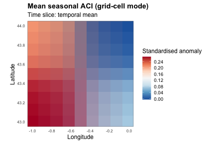

``` r
library(xaci)
```

`calculate_aci()` exposes two **independent** choices about how its output
is aggregated:

* **Spatial** aggregation, via `area` / `admin_level`: a single national
  scalar per period (`area = TRUE`), the full ERA5 grid (`area = FALSE`,
  `admin_level = NULL`, see `vignette("xaci-visualization")`), or one value
  per administrative unit (`admin_level = 1, 2, ...`, see
  `vignette("xaci-admin-levels")`).
* **Temporal** aggregation, via `granularity`: `"month"`, `"season"`,
  `"semester"`, or `"year"` (see `?aggregate_granularity`).

Because these two axes are resolved independently — the underlying
grid-cell computation feeds all of them, and `granularity` is applied only
at the very end — every combination of the three spatial modes and four
granularities is valid. This vignette builds one small synthetic dataset,
computes its components **once**, and then walks the full 3 x 4 matrix,
showing what each combination looks like.

## Building one small synthetic dataset

Same pattern as `vignette("xaci-full-pipeline")`: a tiny 2 x 2 ERA5-like
grid, plus two synthetic PSMSL tide-gauge stations.


``` r
build_synthetic_nc <- function(path, var, unit, lon, lat, time_vec, origin, vals) {
  time_hours <- as.numeric(difftime(time_vec, origin, units = "hours"))
  dim_lon  <- ncdf4::ncdim_def("longitude", "degrees_east", lon)
  dim_lat  <- ncdf4::ncdim_def("latitude", "degrees_north", lat)
  dim_time <- ncdf4::ncdim_def(
    "time", paste0("hours since ", format(origin, "%Y-%m-%d %H:%M:%S")),
    time_hours, unlim = TRUE
  )
  ncvar <- ncdf4::ncvar_def(var, unit, list(dim_lon, dim_lat, dim_time),
                            missval = NA, prec = "double")
  nc <- ncdf4::nc_create(path, list(ncvar))
  ncdf4::ncvar_put(nc, ncvar, vals)
  ncdf4::nc_close(nc)
  invisible(path)
}

build_synthetic_mask <- function(path, lon, lat) {
  dim_lon <- ncdf4::ncdim_def("longitude", "degrees_east", lon)
  dim_lat <- ncdf4::ncdim_def("latitude", "degrees_north", lat)
  var_mask <- ncdf4::ncvar_def("country", "1", list(dim_lon, dim_lat),
                               missval = NA, prec = "double")
  nc <- ncdf4::nc_create(path, list(var_mask))
  ncdf4::ncvar_put(nc, var_mask, matrix(1, length(lon), length(lat)))
  ncdf4::nc_close(nc)
  invisible(path)
}

set.seed(11)
lon      <- c(-1, 0)
lat      <- c(43, 44)
origin   <- as.POSIXct("1900-01-01 00:00:00", tz = "UTC")
time_vec <- seq(as.POSIXct("2011-01-01 00:00", tz = "UTC"),
                as.POSIXct("2014-12-31 23:00", tz = "UTC"), by = "hour")
nlo <- length(lon); nla <- length(lat); nt <- length(time_vec)

trend      <- seq_len(nt) / nt   # mild warming/drying trend
seasonal_t <- 288 + 10 * sin(2 * pi * seq_len(nt) / (24 * 365)) + 0.6 * trend

t2m_vals <- array(NA_real_, c(nlo, nla, nt))
for (i in seq_len(nlo)) for (j in seq_len(nla))
  t2m_vals[i, j, ] <- seasonal_t + (i + j) + rnorm(nt, sd = 1.5)

tp_vals <- array(0, c(nlo, nla, nt))
for (i in seq_len(nlo)) for (j in seq_len(nla)) {
  rain_hours <- rbinom(nt, 1, 0.08 * (1 - 0.3 * trend))
  tp_vals[i, j, ] <- rain_hours * rexp(nt, rate = 800)
}

u10_vals <- array(rnorm(nlo * nla * nt, mean = 3, sd = 4), c(nlo, nla, nt))
v10_vals <- array(rnorm(nlo * nla * nt, mean = 1, sd = 4), c(nlo, nla, nt))

t2m_file  <- tempfile(fileext = ".nc")
tp_file   <- tempfile(fileext = ".nc")
u10_file  <- tempfile(fileext = ".nc")
v10_file  <- tempfile(fileext = ".nc")
mask_file <- tempfile(fileext = ".nc")

build_synthetic_nc(t2m_file, "t2m", "K",     lon, lat, time_vec, origin, t2m_vals)
build_synthetic_nc(tp_file,  "tp",  "m",     lon, lat, time_vec, origin, tp_vals)
build_synthetic_nc(u10_file, "u10", "m s-1", lon, lat, time_vec, origin, u10_vals)
build_synthetic_nc(v10_file, "v10", "m s-1", lon, lat, time_vec, origin, v10_vals)
build_synthetic_mask(mask_file, lon, lat)

month_frac <- c("0417", "125", "2083", "2917", "375", "4583",
                "5417", "625", "7083", "7917", "875", "9583")
build_synthetic_psmsl_station <- function(dir, station_id, years,
                                          base_level, trend_mm_per_year) {
  lines <- character(0)
  for (y in years) {
    for (m in seq_len(12)) {
      level <- base_level + trend_mm_per_year * (y - years[1]) + rnorm(1, sd = 15)
      lines <- c(lines, sprintf("%d.%s;%.1f;0;000", y, month_frac[m], level))
    }
  }
  writeLines(lines, file.path(dir, paste0(station_id, ".txt")))
}

psmsl_dir <- tempfile("psmsl_")
dir.create(psmsl_dir)
build_synthetic_psmsl_station(psmsl_dir, 1,  2011:2014, base_level = 7020, trend_mm_per_year = 3)
build_synthetic_psmsl_station(psmsl_dir, 61, 2011:2014, base_level = 6980, trend_mm_per_year = 4)

# See vignette("xaci-components") for why reference_period needs >= 3 years.
reference_period <- c("2011-01-01", "2013-12-31")  # 3 years
study_period      <- c("2011-01-01", "2014-12-31")  # 4 years

cache_dir <- tempfile("aci_cache_")
dir.create(cache_dir)
```

## Step 1 — compute every component once

The six components (`t90`, `t10`, `precipitation`, `drought`, `wind`,
`sealevel`) are computed from the raw ERA5/PSMSL data **before** any spatial
or temporal aggregation is applied. Caching them with `save = TRUE` lets
every combination explored below reuse the exact same computation — this is
the same `save` / `computed_components` pattern shown in
`vignette("xaci-components")`, just used here across the whole matrix
instead of a single re-run:


``` r
invisible(calculate_aci(
  country_abbrev           = "FRA",
  study_period               = study_period,
  reference_period            = reference_period,
  temperature_data_path      = t2m_file,
  precipitation_data_path    = tp_file,
  wind_u10_data_path          = u10_file,
  wind_v10_data_path          = v10_file,
  mask_data_path               = mask_file,
  sealevel_dir                  = psmsl_dir,
  granularity                    = "month",   # irrelevant here: not cached
  area                            = TRUE,       # irrelevant here: not cached
  admin_level                     = NULL,
  save                             = TRUE,
  save_dir                         = cache_dir,
  computed_components              = FALSE
))
```

Note the two comments above: `granularity` and `area`/`admin_level` are
**not** part of what gets cached at this step — only the raw, unstandardised
components are (see `?calculate_aci`, "computed_components" section). Every
call below reuses this same cache via `computed_components = TRUE`, and can
freely vary spatial mode and granularity without recomputing anything from
the NetCDF/PSMSL files.

## Pre-seeding the administrative cache (no network)

Administrative aggregation normally needs `build_admin_mask()` /
`assign_sealevel_to_admin()`, which download real GADM polygons and a
coastline layer over the network (see `vignette("xaci-admin-levels")`). To
demonstrate the administrative spatial mode here without network access,
we save hand-built `admin_mask` / `admin_assignment` objects directly at the
cache path `calculate_aci()` expects — the exact same trick
`vignette("xaci-admin-levels")` uses at the component level, just applied
one level up so `calculate_aci()` itself can be called directly:


``` r
admin_level <- 1

synthetic_admin_mask <- list(
  units   = c("A", "B"),
  lon     = lon,
  lat     = lat,
  weights = list(
    `1` = c(A = 1, B = 0),   # cell (lon[1], lat[1])
    `2` = c(A = 0, B = 1),   # cell (lon[1], lat[2])
    `3` = c(A = 1, B = 0),   # cell (lon[2], lat[1])
    `4` = c(A = 0, B = 1)    # cell (lon[2], lat[2])
  )
)
synthetic_admin_assignment <- list(
  station_ids = list(A = 1, B = 61),   # PSMSL IDs: Brest -> A, Marseille -> B
  factors     = c(A = 0.6, B = 0.3)    # coastal fraction per region
)

admin_tag <- sprintf("FRA_L%d", admin_level)
saveRDS(synthetic_admin_mask,
       file.path(cache_dir, paste0("admin_mask_", admin_tag, ".rds")))
saveRDS(synthetic_admin_assignment,
       file.path(cache_dir, paste0("admin_assignment_", admin_tag, ".rds")))
```

With both `.rds` files in place, any `calculate_aci(..., admin_level = 1,
computed_components = TRUE)` call below will pick them up directly instead
of trying to build them — no network call, no `geodata`/`rnaturalearth`
lookup.

## The three spatial modes, one temporal granularity

Fixing `granularity = "month"`, here is what each spatial mode returns:


``` r
national_monthly <- calculate_aci(
  country_abbrev = "FRA", study_period = study_period, reference_period = reference_period,
  temperature_data_path      = t2m_file,
  precipitation_data_path    = tp_file,
  wind_u10_data_path          = u10_file,
  wind_v10_data_path          = v10_file,
  mask_data_path               = mask_file,
  granularity = "month", area = TRUE, admin_level = NULL,
  computed_components = TRUE, load_dir = cache_dir
)
class(national_monthly); dim(national_monthly)
#> [1] "data.frame"
#> [1] 48  7
head(national_monthly, 2)
#>            drought wind precipitation       t10        t90   sealevel        ACI
#> 2011-01 -0.9954027    0     0.9008374 0.9203157 -0.8431515  0.6340295 -0.3329282
#> 2011-02 -1.0492241    0     0.9040871 0.9443331 -1.0830902 -1.1163822 -0.4607378
```


``` r
grid_monthly <- calculate_aci(
  country_abbrev = "FRA", study_period = study_period, reference_period = reference_period,
  temperature_data_path      = t2m_file,
  precipitation_data_path    = tp_file,
  wind_u10_data_path          = u10_file,
  wind_v10_data_path          = v10_file,
  mask_data_path               = mask_file,
  granularity = "month", area = FALSE, admin_level = NULL, max_dist_km = 800,
  computed_components = TRUE, load_dir = cache_dir
)
class(grid_monthly); dim(grid_monthly$ACI)   # [lon x lat x time]
#> [1] "list"
#> [1]  2  2 48
```


``` r
admin_monthly <- calculate_aci(
  country_abbrev = "FRA", study_period = study_period, reference_period = reference_period,
  temperature_data_path      = t2m_file,
  precipitation_data_path    = tp_file,
  wind_u10_data_path          = u10_file,
  wind_v10_data_path          = v10_file,
  mask_data_path               = mask_file,
  granularity = "month", admin_level = admin_level,
  computed_components = TRUE, load_dir = cache_dir, save_dir = cache_dir
)
class(admin_monthly); dim(admin_monthly)
#> [1] "data.frame"
#> [1] 48 14
head(admin_monthly[, c("ACI_A", "ACI_B")], 2)
#>              ACI_A      ACI_B
#> 2011-01  0.4551911 -0.7979944
#> 2011-02 -0.3902822 -0.4622599
```

Same underlying components, three genuinely different shapes: a
`data.frame` with one row per month nationally, a `[lon x lat x time]` array
list on the raw grid, and a `data.frame` with one `<component>_<unit>`
column pair per administrative unit.

## The four granularities, one spatial mode

Fixing the national scalar mode (`area = TRUE`), here is the same
computation reported at each temporal granularity:


``` r
granularities <- c("month", "season", "semester", "year")
national_by_granularity <- lapply(granularities, function(g) {
  calculate_aci(
    country_abbrev = "FRA", study_period = study_period, reference_period = reference_period,
    temperature_data_path            = t2m_file,
    precipitation_data_path        = tp_file,
    wind_u10_data_path                    = u10_file,
    wind_v10_data_path                    = v10_file,
    mask_data_path                             = mask_file,
    granularity = g, area = TRUE, admin_level = NULL,
    computed_components = TRUE, load_dir = cache_dir
  )
})
names(national_by_granularity) <- granularities

sapply(national_by_granularity, nrow)   # number of periods per granularity
#>    month   season semester     year 
#>       48       17        8        4
national_by_granularity$semester
#>            drought      wind precipitation         t10        t90   sealevel        ACI
#> 2011-S1 -1.0726834 0.0000000    0.71191686  0.97759636 -1.0646249 -0.2435785 -0.4714814
#> 2011-S2 -0.2508652 0.0000000    0.12721814  0.98284998 -1.0032526 -0.1374611 -0.4110081
#> 2012-S1  0.6393322 0.0000000   -0.01142285 -0.10235882  0.2376682  0.2216346  0.1946660
#> 2012-S2 -0.8133445 0.0000000   -0.24741900 -0.01973684  0.1508050  0.3067992 -0.1593965
#> 2013-S1  0.4333512 0.0000000   -0.70049401 -0.87523753  0.8269567  0.0219439  0.2768154
#> 2013-S2  1.0642097 0.0000000    0.12020086 -0.96311313  0.8524477 -0.1693381  0.5704046
#> 2014-S1  2.8006632 0.2327829   -1.00193126 -1.81931870  1.8426589  0.4725578  1.1130777
#> 2014-S2  1.8220896 0.1969534    0.10514547 -2.23259299  2.5165369  1.3834795  1.3750027
```

## The full matrix

Putting both axes together: 3 spatial modes x 4 granularities = 12 calls,
all reusing the same cache from Step 1:


``` r
spatial_modes <- list(
  national = list(area = TRUE,  admin_level = NULL),
  grid     = list(area = FALSE, admin_level = NULL),
  admin    = list(area = TRUE,  admin_level = admin_level)  # area ignored when admin_level is set
)

matrix_results <- list()
for (mode_name in names(spatial_modes)) {
  mode <- spatial_modes[[mode_name]]
  for (g in granularities) {
    key <- paste(mode_name, g, sep = "_")
    matrix_results[[key]] <- calculate_aci(
      country_abbrev   = "FRA", study_period = study_period, reference_period = reference_period,
      temperature_data_path                  = t2m_file,
      precipitation_data_path            = tp_file,
      wind_u10_data_path                              = u10_file,
      wind_v10_data_path                              = v10_file,
      mask_data_path                                           = mask_file,
      granularity      = g, area = mode$area, admin_level = mode$admin_level,
      max_dist_km      = 800,
      computed_components = TRUE, load_dir = cache_dir, save_dir = cache_dir
    )
  }
}

summarise_result <- function(res) {
  if (is.data.frame(res)) {
    data.frame(class = "data.frame", n_periods = nrow(res), n_columns = ncol(res))
  } else {
    data.frame(class = "grid list",
              n_periods = length(res$time),
              n_columns = paste(dim(res$ACI)[1:2], collapse = " x "))
  }
}

overview <- do.call(rbind, lapply(names(matrix_results), function(key) {
  parts <- strsplit(key, "_")[[1]]
  cbind(spatial = parts[1], granularity = parts[2], summarise_result(matrix_results[[key]]))
}))
rownames(overview) <- NULL
overview
#>     spatial granularity      class n_periods n_columns
#> 1  national       month data.frame        48         7
#> 2  national      season data.frame        17         7
#> 3  national    semester data.frame         8         7
#> 4  national        year data.frame         4         7
#> 5      grid       month  grid list        48     2 x 2
#> 6      grid      season  grid list        17     2 x 2
#> 7      grid    semester  grid list         8     2 x 2
#> 8      grid        year  grid list         4     2 x 2
#> 9     admin       month data.frame        48        14
#> 10    admin      season data.frame        17        14
#> 11    admin    semester data.frame         8        14
#> 12    admin        year data.frame         4        14
```

Twelve calls, twelve distinct shapes, all derived from the same six cached
components — only the last, cheap aggregation step differs between them.

## Mapping one of the grid-cell combinations

As a concrete illustration, `plot_aci_map()` (see
`vignette("xaci-visualization")`) works directly on any grid-cell entry of
the matrix above, whatever its granularity:


``` r
plot_aci_map(matrix_results$grid_season, variable = "ACI", time_index = "mean",
            borders = FALSE, title = "Mean seasonal ACI (grid-cell mode)")
```

<div class="figure">

<p class="caption">plot of chunk unnamed-chunk-10</p>
</div>

## Wrap-up

* Spatial and temporal aggregation are resolved independently in
  `calculate_aci()`: pick any of the 3 spatial modes and any of the 4
  granularities, in any combination.
* The expensive part — computing the six raw components from ERA5/PSMSL
  data — only has to happen once, via `save = TRUE`; every combination
  shown here reused it through `computed_components = TRUE`.
* For real (non-synthetic) administrative aggregation, see
  `vignette("xaci-admin-levels")`; for mapping and plotting any of these
  outputs, see `vignette("xaci-visualization")`; for the six components
  individually, see `vignette("xaci-components")`.


