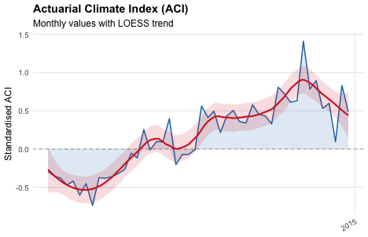
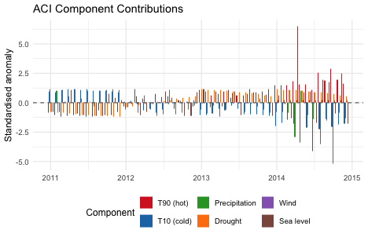
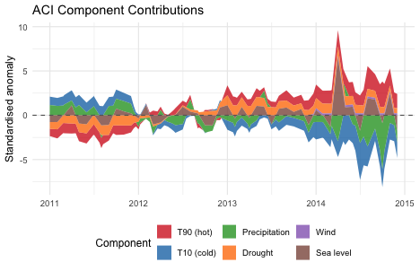
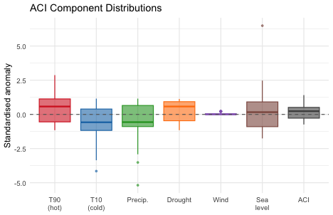
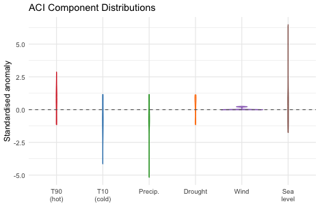
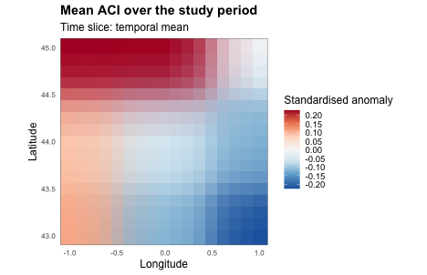
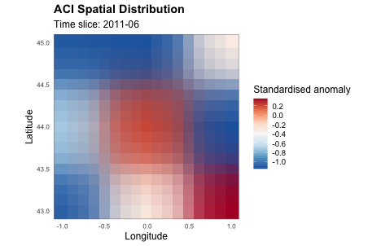
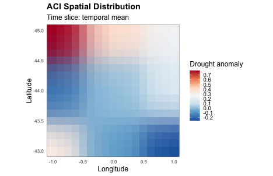
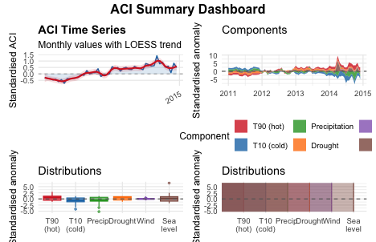

``` r
library(xaci)
```

xaci ships six plotting functions covering the two shapes of output produced
by `calculate_aci()` (see `vignette("xaci-full-pipeline")`): time-indexed
`data.frame`s (national or administrative level) and spatial grids
(grid-cell level, for mapping). This vignette demonstrates each of them on
the same synthetic dataset used throughout this package's vignettes.

## Preparing example results


We compute a national, monthly ACI series (for the time-series-style plots)
and a grid-cell version (for the map), exactly as in
`vignette("xaci-full-pipeline")`:


``` r
monthly_national_aci <- calculate_aci(
  country_abbrev           = "FRA",
  study_period               = study_period,
  reference_period            = reference_period,
  temperature_data_path      = t2m_file,
  precipitation_data_path    = tp_file,
  wind_u10_data_path          = u10_file,
  wind_v10_data_path          = v10_file,
  mask_data_path               = mask_file,
  sealevel_dir                  = psmsl_dir,
  granularity                    = "month",
  area                            = TRUE
)

grid_aci <- calculate_aci(
  country_abbrev           = "FRA",
  study_period               = study_period,
  reference_period            = reference_period,
  temperature_data_path      = t2m_file,
  precipitation_data_path    = tp_file,
  wind_u10_data_path          = u10_file,
  wind_v10_data_path          = v10_file,
  mask_data_path               = mask_file,
  sealevel_dir                  = psmsl_dir,
  granularity                    = "month",
  area                            = FALSE,
  admin_level                     = NULL,
  # See the note in vignette("xaci-components") on why this toy example
  # widens max_dist_km beyond its 500 km default -- without it, a couple of
  # cells in our fictitious grid would have no sea-level station in range
  # (NA there, and NA ACI as a result), leaving visible gaps on the map.
  max_dist_km                     = 800
)
```

## Time series: `plot_aci_timeseries()`


``` r
plot_aci_timeseries(monthly_national_aci, smooth = TRUE, span = 0.3)
```



With only two years of monthly (24-point) synthetic data the LOESS trend
line is not very meaningful — with real, multi-decade data it highlights
the long-run direction of the index. `fill_area = TRUE` (the default) shades
the area between the series and zero, making positive/negative months
visually distinct; `colour` controls the line colour.

## Component breakdown: `plot_aci_components()`


``` r
plot_aci_components(monthly_national_aci, type = "bar")
```




``` r
plot_aci_components(monthly_national_aci, type = "stacked")
```



`components` restricts the plot to a subset, e.g.
`plot_aci_components(monthly_national_aci, type = "bar", components = c("t90", "t10"))`
to focus on temperature only.

## Distributions: `plot_aci_distribution()`


``` r
plot_aci_distribution(monthly_national_aci, type = "boxplot", include_aci = TRUE)
```




``` r
plot_aci_distribution(monthly_national_aci, type = "violin")
```



`type = "density"` is also available. This is useful to compare the spread
of each component at a glance, e.g. to spot which one is driving an
unusually high or low ACI value in a given month.

## Maps: `plot_aci_map()`

`plot_aci_map()` dispatches on its input: a grid-cell list or bare array
produces a **raster** map; a `data.frame` (administrative-level output, see
`vignette("xaci-admin-levels")`) produces a **choropleth**. Here we use the
grid-cell result computed above, averaged over the whole study period:


``` r
plot_aci_map(grid_aci, variable = "ACI", time_index = "mean",
             borders = FALSE, title = "Mean ACI over the study period")
```



`borders = TRUE` (the default) overlays the country's administrative
boundary, downloaded on demand via `rnaturalearth` / GADM — this requires
network access, so it is disabled (`borders = FALSE`) in this
self-contained example. In an interactive session with network access, you
can drop `borders = FALSE` to get the overlay for free.

A single time slice can be plotted by passing an integer instead of
`"mean"`:


``` r
plot_aci_map(grid_aci, variable = "t90", time_index = 6, borders = FALSE)
```



A bare array (e.g. `grid_aci$ACI` on its own, once it carries `lon`/`lat`
attributes as `calculate_aci()` attaches them) also works directly:


``` r
plot_aci_map(grid_aci$drought, time_index = "mean", borders = FALSE,
             var_label = "Drought anomaly")
```



## Dashboard: `plot_aci_dashboard()`

`plot_aci_dashboard()` arranges the time series, component facets, boxplot
and density plots into a single figure. It requires the `patchwork`
package:


``` r
if (requireNamespace("patchwork", quietly = TRUE)) {
  plot_aci_dashboard(monthly_national_aci)
} else {
  message("Install the 'patchwork' package to use plot_aci_dashboard().")
}
```



## Animated maps: `animate_aci_map()`

For a time-evolving view of a spatial variable, `animate_aci_map()` produces
a GIF (requires the `gganimate` and `gifski` packages). This is
computationally heavier and not run in this vignette, but the call looks
like:


``` r
animate_aci_map(grid_aci, variable = "ACI", fps = 2,
                save_path = "aci_animation.gif")
```


